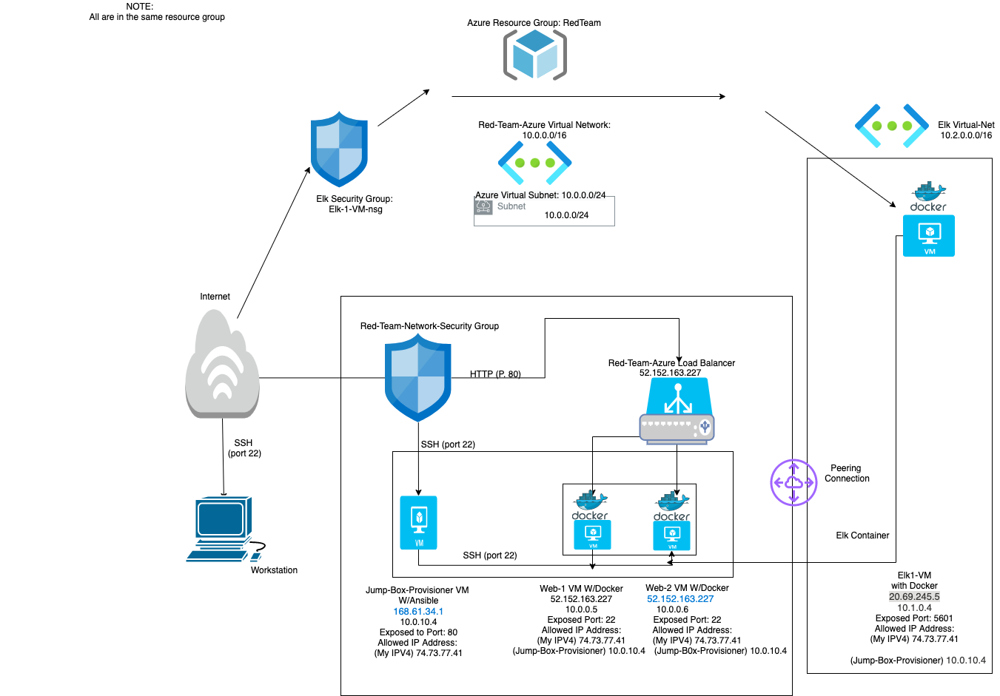
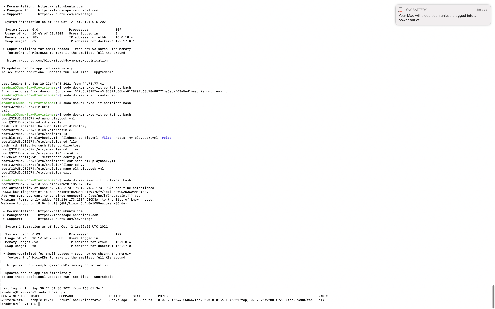

# CyprianMichael
Project repository
## Automated ELK Stack Deployment

The files in this repository were used to configure the network depicted below.



These files have been tested and used to generate a live ELK deployment on Azure. They can be used to either recreate the entire deployment pictured above. Alternatively, select portions of the _____ file may be used to install only certain pieces of it, such as Filebeat.

  - _TODO: Enter the playbook file._
Elk-playbook.yml
```
---
- name: Configure Elk VM with Docker
  hosts: elk
  remote_user: azadmin
  become: true
  tasks:
    # Use apt module
    - name: Install docker.io
      apt:
        update_cache: yes
        force_apt_get: yes
        name: docker.io
        state: present

      # Use apt module
    - name: Install python3-pip
      apt:
        force_apt_get: yes
        name: python3-pip
        state: present

      # Use pip module (It will default to pip3)
    - name: Install Docker module
      pip:
        name: docker
        state: present

      # Use command module
    - name: Increase virtual memory
      command: sysctl -w vm.max_map_count=262144

      # Use sysctl module
    - name: Use more memory
      sysctl:
        name: vm.max_map_count
        value: '262144'
        state: present
        reload: yes

      # Use docker_container module
    - name: download and launch a docker elk container
      docker_container:
        name: elk
        image: sebp/elk:761
        state: started
        restart_policy: always
        # Please list the ports that ELK runs on
        published_ports:
          -  5601:5601
          -  9200:9200
          -  5044:5044

      # Use systemd module
    - name: Enable service docker on boot
      systemd:
        name: docker
        enabled: yes
```

This document contains the following details:
- Description of the Topologu
- Access Policies
- ELK Configuration
  - Beats in Use
  - Machines Being Monitored
- How to Use the Ansible Build


### Description of the Topology

The main purpose of this network is to expose a load-balanced and monitored instance of DVWA, the D*mn Vulnerable Web Application.

Load balancing ensures that the application will be highly available and reliable, in addition to restricting traffic to the network.
- _TODO: What aspect of security do load balancers protect? Availability 
 What is the advantage of a jump box? Just box gives possible access to the virtual machines at once without having us ssh individually into the virtual boxes.

Integrating an ELK server allows users to easily monitor the vulnerable VMs for changes to the data and system logs.
- _TODO: What does Filebeat watch for? Filebeats watches and monitors specified log files in the file system.
- _TODO: What does Metricbeat record? Metric beats records collected metrics and statistics and sends them to Elk.

The configuration details of each machine may be found below.
_Note: Use the [Markdown Table Generator](http://www.tablesgenerator.com/markdown_tables) to add/remove values from the table_.

| Name     | Function         | Allowed IP Address    | Operating System |
|----------|------------------|-----------------------|------------------|
| Jump Box | Gateway          | 10.0.10.4             | Linux            |
| Web-1    |  Access to DVWA  | 10.0.10.5.            | Linux            |
| Web-2    |  Access to DVWA  | 10.0.10.6             | Linux            |
| Elk.     |  Access to Kibana| 10.0.0.4              | Linux            |

### Access Policies

The machines on the internal network are not exposed to the public Internet. 

Only the Elk machine can accept connections from the Internet. Access to this machine is only allowed from the following IP addresses:74.73.77.41
- _TODO: Add whitelisted IP addresses_

Machines within the network can only be accessed over SSH by Jump Box Provisioner..
- _TODO: Which machine did you allow to access your ELK VM? Jump Box Provisioner via SSH & my local machine. What was its IP address? Jump Box Provisioner Private IP: 10.0.10.4 And Local Machine Public IP:74.73.77.41

A summary of the access policies in place can be found in the table below.

| Name     | Publicly Accessible | Allowed IP Addresses   |
|----------|---------------------|----------------------  |
| Jump Box | Yes/No              | 74.73.77.41     |
| Web-1    | Yes                 | 74.73.77.41, 10.0.10.4 |
| Web-2.     Yes                   74.73.77.41, 10.0.10.4
  Elk      | Yes                 | 74.73.77.41            |

### Elk Configuration

Ansible was used to automate configuration of the ELK machine. No configuration was performed manually, which is advantageous because...
- _TODO: What is the main advantage of automating configuration with Ansible?It enables quick and easy deployment of the my configurations.

The playbook implements the following tasks:
- _TODO: In 3-5 bullets, explain the steps of the ELK installation play. E.g., install Docker; download image; etc._
- Installs modules (docker.io, python3-pip, docker via pip module)
- enables service docker on boot 
--Allows Elk to run on a specified ports
- Increases system memories
-Specify the Vm/ Users

The following screenshot displays the result of running `docker ps` after successfully configuring the ELK instance.



### Target Machines & Beats
This ELK server is configured to monitor the following machines:
- _TODO: List the IP addresses of the machines you are monitoring_
--Web-1 : 10.0.10.5
--Web-2 : 10.0.10.6

We have installed the following Beats on these machines:
- _TODO: Specify which Beats you successfully installed:

--- Filebeat & Metricbeat on Elk Server


These Beats allow us to collect the following information from each machine:
- _TODO: In 1-2 sentences, explain what kind of data each beat collects, and provide 1 example of what you expect to see. E.g., `Winlogbeat` collects Windows logs, which we use to track user logon events, etc._

-- Filebeat: This collects data about the file systems, such as, system logs.
-- Metricbeat: This collects machine metric data such as uptime

### Using the Playbook
In order to use the playbook, you will need to have an Ansible control node already configured. Assuming you have such a control node provisioned: 

SSH into the control node and follow the steps below:
- Copy the elk-playbook.yml file to a a location on your sensible control node.
- Update the host file to include (the Private IP of your Elk machine) ansible_python_interpreter=/usr/bin/python3
  - Ex: 10.1.0.4 ansible_python_interpreter=/usr/bin/python3

 
- Run the playbook, and navigate to http://[your.elk-vm.external.ip]:5601/app/kibana  to check that the installation worked as expected.


_As a **Bonus**, provide the specific commands the user will need to run to download the playbook, update the files, etc._
Command to run the playbook:
    - ansible-playbook (playbook-name).yml

- To Update the file:
     -nano (playbook-name).yml
